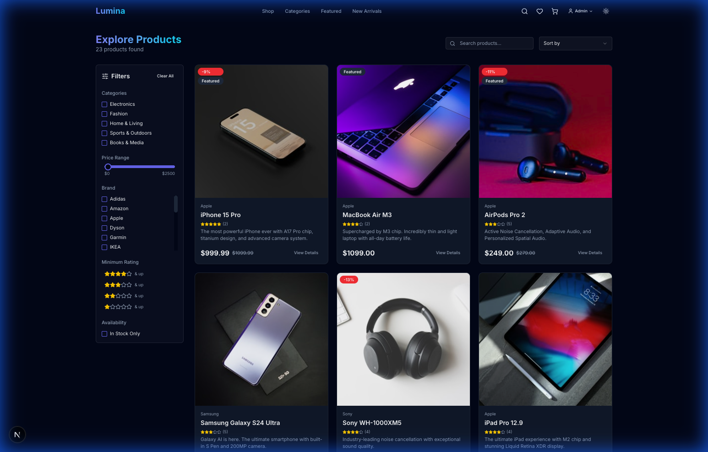
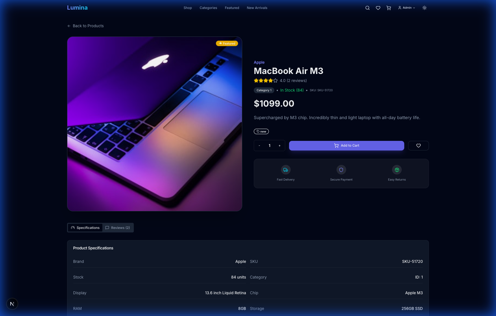
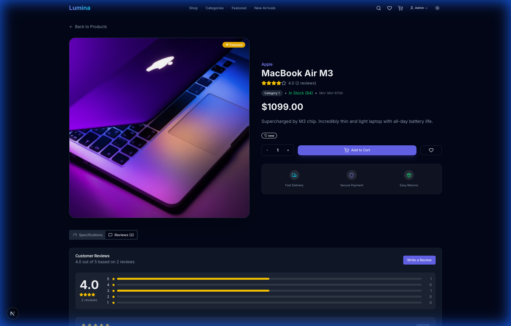
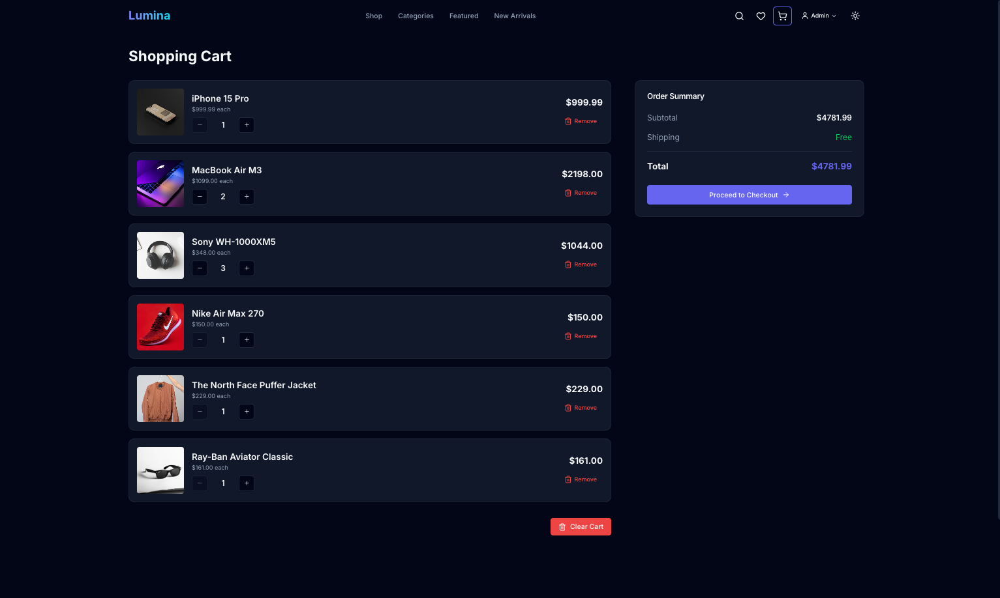
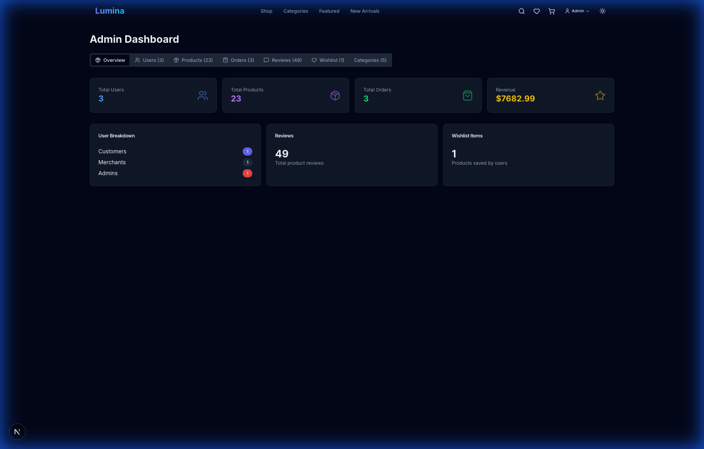

# Lumina E-Commerce Platform

A modern, full-stack e-commerce application built with **Next.js 16** and **FastAPI**, featuring Stripe payment integration, real-time cart management, multi-role authentication, comprehensive admin dashboard, and a premium dark-themed UI experience.


## ✨ Features

### 🛍️ Customer Features
- **Product Catalog** - Browse products with search, category, brand, and price filtering
- **Product Details** - Rich product pages with specifications, reviews, and ratings
- **Shopping Cart** - Real-time cart with quantity controls (Redis-backed)
- **Wishlist** - Save products for later purchase
- **Reviews & Ratings** - Read and write product reviews with star ratings
- **Stripe Checkout** - Secure payments with multiple methods (Card, Affirm, Cash App, Klarna, Amazon Pay)
- **Order History** - View past orders and order details
- **Dark/Light Mode** - Theme switching with system preference detection
- **Authentication** - Secure JWT-based login and registration

### 🏪 Merchant Features
- **Merchant Dashboard** - Overview of sales, orders, and products
- **Product Management** - Create and update product listings
- **Order Tracking** - View orders containing your products

### 👑 Admin Features
- **Complete Dashboard** - 7 comprehensive tabs for full platform management
- **User Management** - View all users, change roles (customer/merchant/admin)
- **Product Management** - View all products, toggle featured status
- **Order Management** - View all orders, update order status
- **Review Moderation** - View, search, and delete inappropriate reviews
- **Wishlist Analytics** - View all wishlist items across users
- **Category Management** - Create and manage product categories

---

## 📸 Screenshots

### Product Catalog


### Product Details with Reviews


### Customer Reviews


### Shopping Cart


### Admin Dashboard


---

## 🛠️ Tech Stack

| Layer | Technology |
|-------|------------|
| **Frontend** | Next.js 16 (App Router), TypeScript, Tailwind CSS, shadcn/ui |
| **Backend** | FastAPI (Python), Pydantic v2, SQLAlchemy |
| **Database** | PostgreSQL / SQLite |
| **Cache** | Redis (cart storage) |
| **Payments** | Stripe API |
| **Auth** | JWT (python-jose) |

---

## 🚀 Getting Started

### Prerequisites
- Node.js 18+
- Python 3.11+
- Redis (or Docker)

### 1. Clone the Repository
```bash
git clone https://github.com/your-username/ecommerce_project.git
cd ecommerce_project
```

### 2. Backend Setup
```bash
# Create virtual environment
python -m venv .venv
source .venv/bin/activate  # Windows: .venv\Scripts\activate

# Install dependencies
cd backend
pip install -r requirements.txt

# Set environment variables
cp .env.example .env
# Edit .env with your values

# Run the server
uvicorn app.main:app --reload --port 8000
```

### 3. Frontend Setup
```bash
cd frontend

# Install dependencies
npm install

# Set environment variables
cp .env.example .env.local
# Edit .env.local with your values

# Run development server
npm run dev
```

### 4. Start Redis
```bash
# Using Docker
docker run -d -p 6379:6379 redis

# Or install locally
redis-server
```

### 5. Seed Database (Optional)
```bash
cd backend
python seed_data.py
```

---

## 🔑 Environment Variables

### Backend (`.env`)
```env
SECRET_KEY=your-jwt-secret-key-change-in-production
DATABASE_URL=sqlite:///./app.db  # or postgresql://...
STRIPE_SECRET_KEY=sk_test_xxx
STRIPE_WEBHOOK_SECRET=whsec_xxx
REDIS_URL=redis://localhost:6379
```

### Frontend (`.env.local`)
```env
NEXT_PUBLIC_API_URL=http://localhost:8000
NEXT_PUBLIC_STRIPE_PUBLISHABLE_KEY=pk_test_xxx
```

---

## 📚 API Endpoints

### Authentication
| Method | Endpoint | Description |
|--------|----------|-------------|
| POST | `/auth/signup` | Create new user account |
| POST | `/auth/login` | Login and receive JWT token |
| GET | `/auth/me` | Get current user info |

### Products
| Method | Endpoint | Description |
|--------|----------|-------------|
| GET | `/products/` | List all products (with search/filter) |
| GET | `/products/{id}` | Get product details |
| GET | `/products/featured` | Get featured products |
| GET | `/products/brands` | Get all product brands |

### Categories
| Method | Endpoint | Description |
|--------|----------|-------------|
| GET | `/categories/` | List all categories |
| POST | `/categories/` | Create category (admin) |

### Cart
| Method | Endpoint | Description |
|--------|----------|-------------|
| GET | `/cart/` | Get user's cart |
| POST | `/cart/add` | Add item to cart |
| PUT | `/cart/update` | Update item quantity |
| DELETE | `/cart/remove/{id}` | Remove item from cart |
| DELETE | `/cart/clear` | Clear entire cart |

### Wishlist
| Method | Endpoint | Description |
|--------|----------|-------------|
| GET | `/wishlist/` | Get user's wishlist |
| POST | `/wishlist/{product_id}` | Add to wishlist |
| DELETE | `/wishlist/{product_id}` | Remove from wishlist |
| GET | `/wishlist/check/{product_id}` | Check if in wishlist |

### Reviews
| Method | Endpoint | Description |
|--------|----------|-------------|
| GET | `/reviews/product/{id}` | Get product reviews |
| GET | `/reviews/product/{id}/stats` | Get rating statistics |
| POST | `/reviews/` | Submit a review |
| POST | `/reviews/{id}/helpful` | Mark review as helpful |

### Orders
| Method | Endpoint | Description |
|--------|----------|-------------|
| GET | `/orders/` | Get user's orders |
| POST | `/orders/checkout` | Complete checkout |

### Payments
| Method | Endpoint | Description |
|--------|----------|-------------|
| POST | `/payment/create-intent` | Create Stripe PaymentIntent |
| GET | `/payment/verify/{id}` | Verify payment status |

### Admin (🔒 Admin only)
| Method | Endpoint | Description |
|--------|----------|-------------|
| GET | `/admin/dashboard` | Dashboard statistics |
| GET | `/admin/users` | List all users |
| PUT | `/admin/users/{id}/role` | Update user role |
| GET | `/admin/orders` | List all orders |
| PUT | `/admin/orders/{id}/status` | Update order status |
| GET | `/admin/products` | List all products |
| PUT | `/admin/products/{id}/featured` | Toggle featured |
| GET | `/admin/categories` | List all categories |
| GET | `/admin/reviews` | List all reviews |
| DELETE | `/admin/reviews/{id}` | Delete review |
| GET | `/admin/wishlist-stats` | Wishlist statistics |
| GET | `/admin/wishlist-items` | All wishlist items |

### Merchant (🔒 Merchant only)
| Method | Endpoint | Description |
|--------|----------|-------------|
| GET | `/merchant/dashboard` | Merchant statistics |
| GET | `/merchant/products` | List merchant's products |
| POST | `/merchant/products` | Create product |
| PUT | `/merchant/products/{id}` | Update product |
| GET | `/merchant/orders` | Orders with merchant's products |

---

## 🧪 Testing

### Test Accounts
| Role | Email | Password |
|------|-------|----------|
| Admin | `admin@lumina.com` | `admin123` |
| Merchant | `merchant@lumina.com` | `merchant123` |
| Customer | `customer@example.com` | `customer123` |

### Stripe Test Cards
| Card Number | Scenario |
|-------------|----------|
| `4242 4242 4242 4242` | ✅ Successful payment |
| `4000 0000 0000 0002` | ❌ Card declined |
| `4000 0025 0000 3155` | 🔐 Requires authentication |

Use any future expiry date, any 3-digit CVC, and any ZIP code.

---

## 📁 Project Structure

```
ecommerce_project/
├── backend/
│   ├── app/
│   │   ├── core/           # Config, security, dependencies
│   │   ├── models/         # SQLAlchemy models (User, Product, Order, Review, Wishlist)
│   │   ├── routers/        # API endpoints (auth, products, cart, admin, merchant)
│   │   └── schemas/        # Pydantic schemas
│   ├── requirements.txt
│   └── seed_data.py        # Sample data seeder
├── frontend/
│   ├── app/                # Next.js App Router pages
│   │   ├── admin/          # Admin dashboard
│   │   ├── merchant/       # Merchant dashboard
│   │   ├── products/       # Product listing and details
│   │   ├── cart/           # Shopping cart
│   │   └── auth/           # Login and signup
│   ├── components/         # React components (ui, layout)
│   ├── lib/                # API client, utilities
│   └── context/            # Auth context
├── documentation/
│   ├── screenshots/        # UI screenshots
│   ├── api_documentation.md
│   └── deployment.md
└── docker-compose.yml
```

---

## 🚀 Deployment

### Free Tier Deployment Stack
| Service | Provider | Free Tier |
|---------|----------|-----------|
| Frontend | Vercel | Unlimited deploys |
| Backend | Render | 750 hrs/month |
| Database | Neon PostgreSQL | 0.5GB storage |
| Redis | Upstash | 10K commands/day |

See the [Deployment Guide](./documentation/deployment.md) for detailed instructions.

---

## 🔄 Recent Updates

### v2.0 - Admin & Reviews Enhancement
- ✅ **Admin Dashboard** - 7 tabs with full platform management
- ✅ **Reviews Tab** - View and moderate all product reviews
- ✅ **Wishlist Tab** - View all wishlist items across users
- ✅ **Search & Filter** - All admin tables have search and filter
- ✅ **Product Details** - Specifications tab and reviews with ratings
- ✅ **Review Submission** - Users can submit reviews with star ratings

### v1.0 - Initial Release
- 🛒 Shopping cart with Redis
- 💳 Stripe payment integration
- 👤 Multi-role authentication
- 🏪 Merchant product management

---

## 📄 License

MIT License - feel free to use this project for learning or commercial purposes.

---

## 🤝 Contributing

1. Fork the repository
2. Create a feature branch (`git checkout -b feature/amazing-feature`)
3. Commit your changes (`git commit -m 'Add amazing feature'`)
4. Push to the branch (`git push origin feature/amazing-feature`)
5. Open a Pull Request
